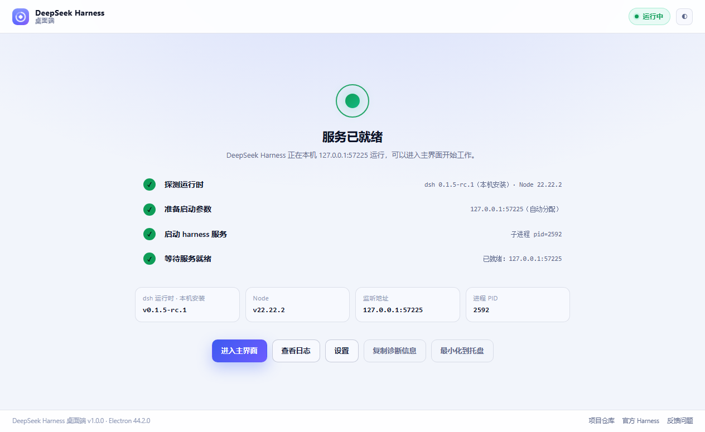
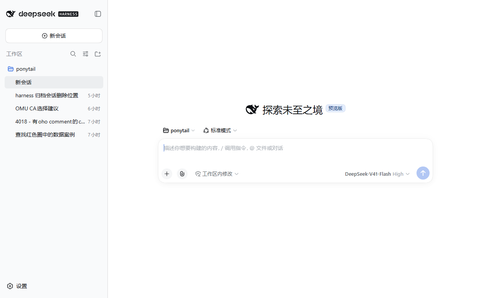

# DeepSeek Harness Desktop

> A native desktop shell for DeepSeek Harness (dsh) — double-click and go, without touching a single line of upstream code.

[简体中文](README.md) | **English**

<p align="center">
  
</p>

DeepSeek Harness is DeepSeek's official agent runtime (MIT). The official entry point is one command:

```bash
npx @deepseek-ai/dsh web    # then open http://127.0.0.1:3080
```

For developers that is fine. For daily use it means: install Node, open a terminal, remember the port, babysit a background process, and manually check whether the service is still alive. **This project does exactly one thing — it moves that layer into a desktop app, and leaves the harness itself untouched.**

## What it handles

| Running dsh by hand | What this desktop app does |
| --- | --- |
| Requires Node ≥ 22.19 | Reuses your local Node; falls back to the bundled runtime |
| Terminal command every time | Double-click an icon; the service is started for you |
| Port conflicts, forgotten URLs | Picks a free port automatically, or pin one in settings |
| Closing the terminal kills it | Closing the window goes to tray; the service keeps running and auto-restarts with backoff |
| Errors are a wall of stdout | Built-in live log panel + one-click diagnostics copy |
| Buried among browser tabs | A real native window, tray status, keyboard shortcuts |

## The important part: why it is zero-intrusion

Most wrappers just wait for the port and then load `http://127.0.0.1:3080`. **That fails** on DeepSeek Harness. Measured behavior:

```
$ dsh web --port 0 --no-open
dsh web: http://127.0.0.1:52021/?token=VyniA5RvfDmzPKbLyvfs9M8Y8rL8WcjixK8_sW_l6u8
```

- It binds `127.0.0.1` only, and **a bare request to `/` returns `401`**
- You must open that **one-time token URL**, which returns `303` and sets a session cookie
- `/api` is additionally fenced by a browser-trust check tied to the declared `host:port`

So this project: parses that readiness line → loads the token URL → once authenticated, normalizes the address to a token-free `${origin}/` (so `Ctrl+R` never hits the single-use token) → all within one persistent session partition. **No DOM injection, no style overrides, no request hijacking.** What you see is 100% the official Web UI, so upstream upgrades are followed automatically.

<p align="center">
  
</p>

> Screenshot taken from a real launch: the sidebar shows your existing workspaces and session history; model, mode and permission presets all come from your own `~/.dsh` config.

## Features

**Service lifecycle**
- Three-tier runtime resolution: local global install → bundled copy → `npx`
- Automatic free-port selection with an explicit `--trusted-host`, avoiding 403s on random ports
- Actionable Chinese error messages for timeouts, early exit, port conflicts and missing dependencies
- Backoff auto-restart (2s → 5s → 15s, pauses after 3 crashes in 10 minutes)

**Desktop integration**
- System tray: status, restart, stop, open logs, quit
- Close-to-tray, single-instance lock, focus existing window on second launch
- Window bounds memory with on-screen clamping after monitor changes
- Shortcuts: `Ctrl+R` reload UI, `Ctrl+Shift+R` restart service, `Ctrl+,` settings, `F5` hard reload
- Light / dark / follow-system themes

**Visibility and troubleshooting**
- Four-step boot progress with real details per step
- Live log panel with level colors and optional auto-scroll
- One-click diagnostics: versions, paths, listen address, launch command, last 80 log lines

**Settings**
- Runtime source (auto / local only / bundled only / npx), manual dsh and Node paths
- Host, port, extra launch flags, and a **proxy injected only into the harness child process**
- Close behavior, auto-restart, run at login
- Check for dsh updates against npm

## Install

### Prebuilt binaries

Grab one from [Releases](https://github.com/HaydenSmith1121/deepseek-harness-desktop-zh/releases):

| File | Notes |
| --- | --- |
| `DSH-Desktop-Setup-x.y.z.exe` | NSIS installer with Start Menu and uninstaller |
| `DSH-Desktop-x.y.z-win-x64.zip` | Portable archive — unzip it, then run `DeepSeekHarnessDesktop.exe` |

These builds bundle the dsh runtime, so **they work on a machine with no Node and no dsh installed**.

> Unzip first. Launching the exe straight from inside the archive makes Windows extract the whole
> app to a temp folder on every launch (~3 minutes of blank screen), and leaves roughly 800 MB of
> residue behind each time. That is why this project ships no single-file portable build.

### From source

```bash
git clone https://github.com/HaydenSmith1121/deepseek-harness-desktop-zh.git
cd deepseek-harness-desktop-zh
npm ci
npm start
```

Requires Node.js ≥ 22.19 (dsh relies on built-in zstd for session logs).

### Test and package

```bash
npm test                 # 34 unit tests
npm run self-test:ui     # render every boot-screen state and screenshot it
npm run self-test        # end-to-end: really starts dsh, loads the official UI, screenshots
npm run fetch:dsh        # prepare the bundled runtime into vendor/dsh
npm run dist             # build installer + portable zip into release/
```

## Project layout

```
src/main/       main process: runtime resolution, child-process lifecycle, boot
                orchestration, windows, tray, menu, IPC, settings, logging, self-test
src/preload/    the only bridge to the renderer (namespaced, no DOM intrusion)
src/renderer/   boot screen and settings page (plain HTML/CSS/JS, no build step)
test/           node:test unit tests
scripts/        icon generation (pure-Node rasterizer), bundled runtime fetcher
docs/           COMPATIBILITY.md (measured upstream contract), ARCHITECTURE.md
```

**Zero runtime dependencies.** `dependencies` is empty; only `electron` and `electron-builder` are dev dependencies. The boot screen references no CDN, so it works fully offline.

See [docs/COMPATIBILITY.md](docs/COMPATIBILITY.md) for the measured upstream contract and [docs/ARCHITECTURE.md](docs/ARCHITECTURE.md) for module boundaries and data flow.

## Relationship to upstream

- This is a **community desktop shell**, not an official DeepSeek product
- It does not modify or fork [deepseek-ai/deepseek-harness](https://github.com/deepseek-ai/deepseek-harness)
- It reuses your existing credentials, config, workspaces and session history under `~/.dsh`
- Upstream is a developer preview with explicit breaking-change warnings; that is why the adaptation contract is isolated in one place and documented

## Security

- Renderer: `contextIsolation: true`, `nodeIntegration: false`, `sandbox: true`
- Top-level navigation allowlist: `file://` boot screen and loopback harness addresses only
- Permission allowlist: clipboard and notifications; everything else denied and logged
- The dsh child process binds loopback only and is never exposed
- An agent that can read/write files and run commands deserves care: **use it inside version-controlled directories** and read approval prompts

## License

[MIT](LICENSE) © 2026 HaydenSmith1121 — DeepSeek Harness is open-sourced by DeepSeek under MIT.
