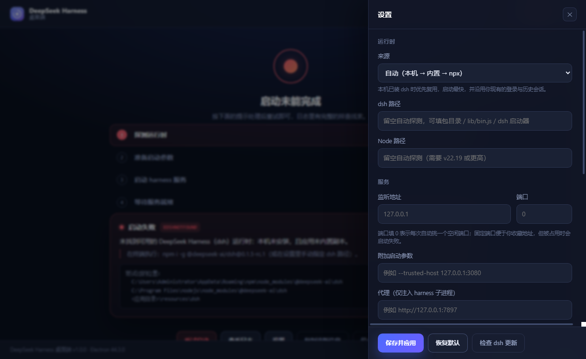
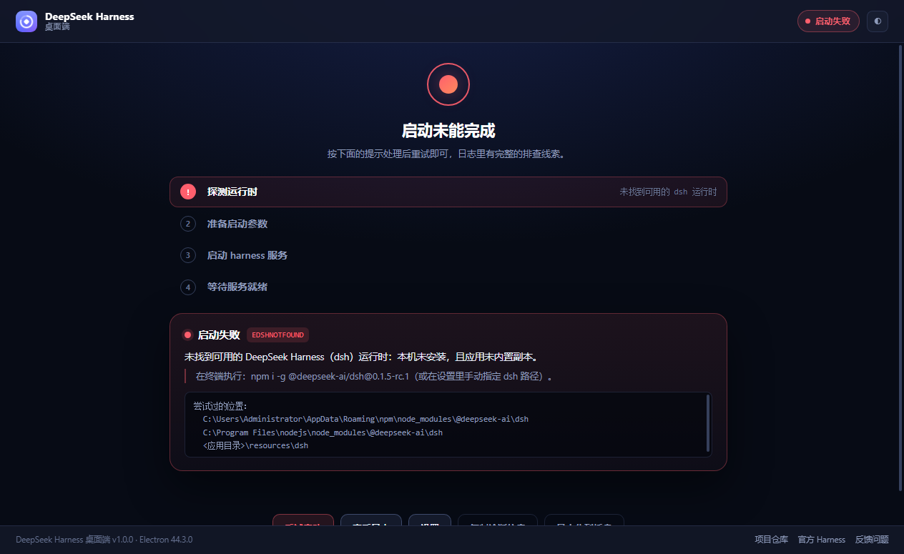

# DeepSeek Harness 桌面端

> 把 DeepSeek Harness（dsh）从终端搬进原生桌面窗口：双击即用，不改一行上游代码。

**简体中文** | [English](README.en.md)

<p align="center">
  
</p>

DeepSeek Harness 是 DeepSeek 官方开源（MIT）的 Agent 运行时，官方入口是一条命令：

```bash
npx @deepseek-ai/dsh web    # 然后浏览器打开 http://127.0.0.1:3080
```

对开发者也许多敲一行命令没什么，但它意味着：装 Node、开终端、记端口、管后台进程、每次还要手动确认服务是否还活着。**本项目只做一件事——把这一层负担收进一个桌面应用，harness 本体一行代码都不动。**

---

## 它解决了什么

| 手动跑 dsh 的麻烦 | 桌面端怎么做 |
| --- | --- |
| 要先装 Node ≥ 22.19 | 优先复用本机 Node；缺失时回退到应用内置的 Node 运行时 |
| 要开终端敲命令 | 双击图标，服务自动拉起 |
| 端口冲突、地址记不住 | 每次自动挑一个空闲端口；也可在设置里固定 |
| 关掉终端服务就没了 | 关窗最小化到托盘，服务继续常驻，崩溃自动退避重启 |
| 报错只看到一屏 stdout | 内置实时日志面板 + 一键复制诊断信息 |
| 浏览器标签页被淹没 | 独立原生窗口、托盘状态、快捷键 |

## 关键设计：为什么叫「零侵入」

多数套壳项目的做法是「等端口，然后加载 `http://127.0.0.1:3080`」。这一步在 DeepSeek Harness 上**会失败**，因为实测下来它的启动流程是这样的：

```
$ dsh web --port 0 --no-open
dsh web: http://127.0.0.1:52021/?token=VyniA5RvfDmzPKbLyvfs9M8Y8rL8WcjixK8_sW_l6u8
```

- 只监听 `127.0.0.1`，**裸访问首页返回 `401`**
- 必须带上这一串**一次性令牌**访问，才会返回 `303` 并下发会话 Cookie
- `/api` 还有一道浏览器信任栅栏，依赖「已声明的 `host:port`」

所以本项目：解析启动输出里那一行 → 带令牌加载 → 认证完成后把地址归一化成不带令牌的干净地址（这样 `Ctrl+R` 重载不会 401）→ 全程复用同一个持久化会话分区。**不注入 DOM、不改样式、不劫持请求**，界面上看到的 100% 是官方 Web UI，上游升级即自动跟随。

<p align="center">
  
</p>

> 上图是真实启动后截的：侧栏里是既有的工作区和历史会话，模型、模式、权限策略全部沿用 `~/.dsh` 里你原有的配置。

## 功能

**服务生命周期**
- 自动探测 dsh：本机全局安装 → 应用内置副本 → `npx` 临时拉取（三级回退）
- 自动选择空闲端口，并把 `--trusted-host` 一并声明，避免随机端口下接口 403
- 启动超时、就绪前退出、端口占用、依赖缺失等失败都有对症的中文提示，而不是一个错误码
- 异常退出后退避重启（2s → 5s → 15s，10 分钟内 3 次后暂停并提示）

**桌面体验**
- 系统托盘常驻：状态、重启、停止、打开日志、退出
- 关闭窗口最小化到托盘（可关），单实例锁 + 二次启动聚焦已有窗口
- 窗口位置尺寸记忆，外接显示器拔掉后自动把窗口拉回可见区域
- 快捷键：`Ctrl+R` 重载界面、`Ctrl+Shift+R` 重启服务、`Ctrl+,` 设置、`F5` 忽略缓存刷新
- 浅色 / 深色 / 跟随系统三档主题

**可视化与排障**
- 四步启动进度（探测运行时 → 准备参数 → 拉起服务 → 等待就绪），每步带真实细节
- 实时日志面板（按级别着色，自动滚动可关），可直接打开日志文件或所在目录
- 一键复制诊断信息：版本、路径、监听地址、启动命令、最近 80 行日志

**设置项**
- 运行时来源（自动 / 仅本机 / 仅内置 / npx）、手动指定 dsh 与 Node 路径
- 监听地址与端口、附加启动参数、**仅注入 harness 子进程的代理**
- 关闭行为、自动重启、开机自启
- 检查 dsh 更新（对比 npm 上的最新版本）

<p align="center">
  
  
</p>

## 安装

### 下载二进制

到 [Releases](https://github.com/HaydenSmith1121/deepseek-harness-desktop-zh/releases) 下载：

| 文件 | 说明 |
| --- | --- |
| `DSH-Desktop-Setup-x.y.z.exe` | 安装包，带开始菜单与卸载入口 |
| `DSH-Desktop-x.y.z-win-x64.zip` | 免安装解压版，解压后双击 `DeepSeekHarnessDesktop.exe` 即可 |

内置版已经带上 dsh 运行时，**目标机器不装 Node、不装 dsh 也能直接跑**。

解压版需要**先解压**，请不要直接双击压缩包里的 exe：那样 Windows 会把它释放到临时目录运行，
每次启动都要重解压一遍（实测约 3 分钟且期间没有任何窗口），退出后还会在临时目录留下约 800MB 残留。
这是本项目不再提供单文件便携版（portable）的原因 —— 解压一次远比每次都解压划算。

### 从源码运行

```bash
git clone https://github.com/HaydenSmith1121/deepseek-harness-desktop-zh.git
cd deepseek-harness-desktop-zh
npm ci
npm start
```

前提：Node.js ≥ 22.19（dsh 依赖内置 zstd 读取会话日志）。

### 自检与打包

```bash
npm test                 # 34 项单元测试
npm run self-test:ui     # 渲染引导页各状态并截图（无需真实 harness）
npm run self-test        # 端到端：真的拉起 dsh、加载官方界面、截图并输出报告
npm run fetch:dsh        # 准备内置运行时到 vendor/dsh
npm run dist             # 打包安装包 + 免安装 zip 到 release/
```

自检产物默认落在 `.self-test/`：开发态是仓库根，打包态是应用数据目录（被打包进 `app.asar` 的目录是只读的，写不进去）。需要指定位置时加 `--self-test-out=<目录>`。

端到端自检会输出一份可读报告，退出码即结论：

```
════════ 自检报告 ════════
模式        : full
结果        : PASS ✅
检查项      : 8/8 通过
页面标题    : DeepSeek Harness
最终地址    : http://127.0.0.1:57225/
console 错误: 0
请求失败    : 0 条接口级 / 9 条导航中断（无害）
截图        : 3 张 → .self-test/full
═════════════════════════
```

## 项目结构

```
src/
  main/                   主进程（仅在 Node 侧，不经渲染层）
    index.js              编排：窗口 / 托盘 / 菜单 / IPC / 崩溃重启 / 退出
    runtime.js            运行时探测：Node 与 dsh 的定位与回退（纯函数，可注入 platform/env）
    ports.js              空闲端口分配
    server.js             HarnessServer：dsh 子进程生命周期 + 就绪解析 + 健康检查
    boot.js               启动编排：四步进度 + 错误到可操作提示的映射
    window.js             主窗口、导航白名单、权限策略
    settings.js           设置持久化（原子写 + schema 收敛）
    logger.js             文件日志 + 内存环形缓冲 + 事件广播
    tray.js / menu.js     托盘与菜单
    self-test.js          自检采集器（截图 / console / 请求失败 / 导航响应码）
  preload/preload.js      唯一的主进程桥（命名空间隔离，零 DOM 侵入）
  renderer/               引导页与设置页（原生 HTML/CSS/JS，无构建步骤，可离线）
test/                     node:test 单元测试
scripts/                  图标生成（纯 Node 光栅化）、内置运行时拉取
docs/COMPATIBILITY.md     上游契约实测记录（改代码前先看这份）
docs/ARCHITECTURE.md      模块职责与数据流
```

**零运行时依赖**：`dependencies` 为空，只有 `electron` 与 `electron-builder` 两个开发依赖。引导页不含任何 CDN 资源，断网可用。

## 与官方 Harness 的关系

- 本项目是**社区桌面外壳**，不是 DeepSeek 官方产品
- 不修改、不分叉 [deepseek-ai/deepseek-harness](https://github.com/deepseek-ai/deepseek-harness) 的任何代码
- 复用你 `~/.dsh` 下已有的凭据、配置、工作区与会话历史
- 上游处于 developer preview，README 明确提示会有破坏性变更；本项目因此把「适配契约」集中在一处并写成文档（见 `docs/COMPATIBILITY.md`），上游若有变动只需改那一小块

## 安全边界

- 渲染层：`contextIsolation: true`、`nodeIntegration: false`、`sandbox: true`
- 顶层导航白名单：仅 `file://` 引导页与 `127.0.0.1` 上的 harness 地址；其它链接交给系统浏览器
- 权限请求白名单：剪贴板与通知，其余一律拒绝并记录
- dsh 子进程只监听回环地址，不对外暴露
- Agent 具备读写文件与执行命令的能力，请**始终在受版本控制的目录里使用**，并在授权提示出现时确认内容

## 常见问题

**启动时提示找不到 dsh？**
执行 `npm i -g @deepseek-ai/dsh@0.1.5-rc.1`，或在设置里手动指定 dsh 路径（支持包目录 / `lib/bin.js` / 启动器三种写法）。

**提示 Node 版本过低？**
需要 ≥ 22.19。装好后在设置里指定 Node 路径即可，无需重装应用。

**端口被占用？**
把设置里的端口改成 `0`（自动分配），或换一个空闲端口。

**界面能打开但接口 401 / 403？**
多半是固定端口与服务实际端口不一致。本项目已显式声明 `--trusted-host`，若你自定义了 `--host` 或附加参数，请一并检查。

**国内拉 `ghcr.io` / npm 很慢？**
在设置里填子进程代理（例如 `http://127.0.0.1:7897`），只影响 harness 子进程，桌面壳自身不走代理。

## License

[MIT](LICENSE) © 2026 HaydenSmith1121
DeepSeek Harness 由 DeepSeek 以 MIT 协议开源。
